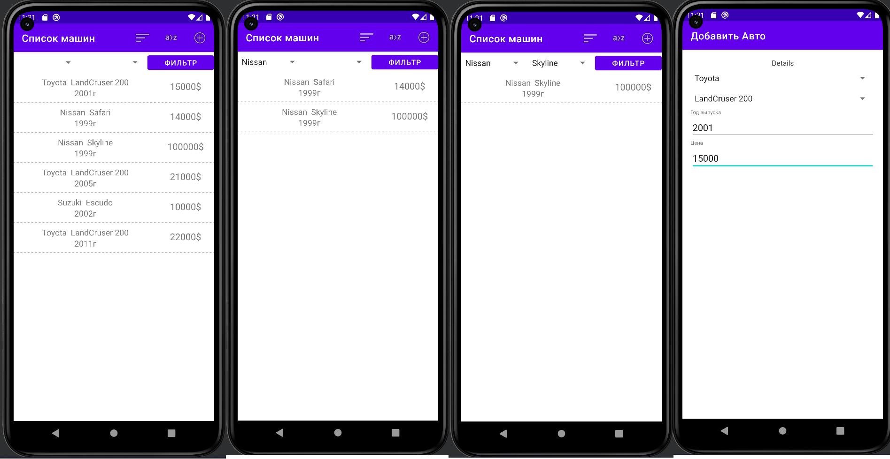

МИНИСТЕРСТВО НАУКИ И ВЫСШЕГО ОБРАЗОВАНИЯ
РОССИЙСКОЙ ФЕДЕРАЦИИ
ФЕДЕРАЛЬНОЕ ГОСУДАРСТВЕННОЕ БЮДЖЕТНОЕ
ОБРАЗОВАТЕЛЬНОЕ УЧРЕЖДЕНИЕ ВЫСШЕГО ОБРАЗОВАНИЯ
«САХАЛИНСКИЙ ГОСУДАРСТВЕННЫЙ УНИВЕРСИТЕТ»

      

Институт естественных наук и техносферной безопасности Кафедра информатики Чагочкин Никита

   

Лабораторная работа №8.2 «Приложение Авто» 01.03.02 Прикладная математика и информатика

            

Научный руководитель 
Соболев Евгений Игоревич

   

г. Южно-Сахалинск 2023 г.

***
# 
Задача

Приложение, должно иметь следующие функции:
•	Отображение списка автомобилей с характеристиками (10-12 автомобилей, 3 производителя, 1-3 марки у каждого производителя)
•	Добавление нового автомобиля
•	Редактирование деталей автомобиля
Желательно:
•	Фильтрация по производителю и марке
•	Сортировка по цене

***
# 
Решение 

#### 
За основу взят код из 14 темы

## 
Фильтрация по производителю 

        brandField=view.findViewById(R.id.auto_brand) as Spinner
        modelField=view.findViewById(R.id.auto_model) as Spinner
        filterButton=view.findViewById(R.id.fButton) as Button

        brandAdapter = ArrayAdapter(requireContext(), android.R.layout.simple_spinner_item, brands)
        brandAdapter.setDropDownViewResource(android.R.layout.simple_spinner_dropdown_item)
        brandField.setAdapter(brandAdapter)

        modelAdapter = ArrayAdapter(requireContext(), android.R.layout.simple_spinner_item, tModels)
        brandField.onItemSelectedListener = object : AdapterView.OnItemSelectedListener {
            override fun onItemSelected(parent: AdapterView<*>?, view: View?, position: Int, id: Long) {
                if(brandField.selectedItem as String=="Toyota"){
                    modelAdapter = ArrayAdapter(requireContext(), android.R.layout.simple_spinner_item, tModels)
                }
                if(brandField.selectedItem as String=="Nissan"){
                    modelAdapter = ArrayAdapter(requireContext(), android.R.layout.simple_spinner_item, nModels)
                }
                if(brandField.selectedItem as String=="Suzuki"){
                    modelAdapter = ArrayAdapter(requireContext(), android.R.layout.simple_spinner_item, sModels)
                }

                modelAdapter.setDropDownViewResource(android.R.layout.simple_spinner_dropdown_item);
                modelField.setAdapter(modelAdapter);

            }

            override fun onNothingSelected(parent: AdapterView<*>?) {
                //toast
            }
        }
        filterButton.setOnClickListener{
            autoListViewModel.autoListLiveData.observe(
                viewLifecycleOwner,
                Observer { autos ->
                    autos?.let {
                        var sortedAutos=ArrayList<Auto>()
                        for (i in 0..autos.size-1){
                            if(autos[i].brand.toString().contains(brandField.selectedItem.toString()) && autos[i].model.toString().contains(modelField.selectedItem.toString())){
                                sortedAutos.add(autos[i])
                            }
                        }
                        updateUI(sortedAutos)
                    }
                })
        }

## 
Сортировка по цене и алфавиту
 

        override fun onOptionsItemSelected(item: MenuItem): Boolean {
        return when (item.itemId) {
            R.id.new_auto -> {
                val auto = Auto()
                autoListViewModel.addAuto(auto)
                callbacks?.onAutoSelected(auto.id)
                true
            }
            R.id.sort -> {
                autoListViewModel.autoListLiveData.observe(
                    viewLifecycleOwner,
                    Observer { autos ->
                        autos?.let {
                            var sortedAutos=autos.sortedByDescending { it.price }
                            updateUI(sortedAutos)
                        }
                    })
                true
            }
            R.id.sort_by_alphabet ->{
                autoListViewModel.autoListLiveData.observe(
                    viewLifecycleOwner,
                    Observer { autos ->
                        autos?.let {
                            var sortedAutos=autos.sortedByDescending { it.brand }
                            updateUI(sortedAutos)
                        }
                    })
                true
            }

            else -> return super.onOptionsItemSelected(item)
        }
    }

